# Computational Dependency Graph — Doerig et al. 2025 (NMI 7:1220–1234)

**Purpose:** implementation-ready reconstruction of every computational pipeline in the paper. An engineer should be able to build the whole paper from this document alone.
**Source read:** `/home/snucsnl/ralphton/laion_data/paper/re_vision.pdf` — all 18 pages (journal pp. 1220–1234 + Nature Portfolio Reporting Summary). **Supplementary Information is NOT in this repository** and was not read; every Supp.-Fig.-only detail is therefore marked UNVERIFIED.
**Companion (do not duplicate):** `/home/snucsnl/ralphton/laion_data/reports/paper_structure.md` (sections/figures/claims/conflicts). This document is the *computational* view; claims C1–C20 and conflicts X1–X6 live there.
**Supersedes:** the previous revision of this file (its Adam-ε value was wrong; see §9/MI-31).

Citation convention: `(p.N, §Section)` or `(p.N, Fig. N)`. Anything not carrying a citation is either **[DERIVED]** (arithmetic on paper-stated numbers, shown) or **[MISSING]** (in §9).

---

## 0. Reading order / TL;DR of the dependency structure

The paper is **one brain-side artifact** (NSD single-trial betas → session z-scored → repetition-averaged) crossed with **one text-side encoder** (MPNet `all-mpnet-base-v2`, 768-d, averaged over 5 COCO captions), joined by **exactly two mapping families**:

* **RSA family** (parameter-free, RDM ↔ RDM Pearson) → Figs. 1b, 3, 4c, 4d, 4e
* **Ridge family** (fractional ridge regression, `fracridge`) → Figs. 1c, 1d, 2a, 2b

plus **one ANN-training family** (BLT-RCNN / ResNet50, image → 768-d MPNet target, cosine-distance loss) → Fig. 4, whose outputs re-enter the RSA family.

Everything else is a *variant of the text input* (category words, nouns, verbs, single words, scrambled) or a *variant of the model side* (fastText, GloVe, multi-hot, 13 published ANNs). **There is no third mapping method.** Merge aggressively.

---

## 1. Data provenance table

| # | Artifact | Exact identifier | Version / selection stated in paper | Where obtained | Shape / size | Notes |
|---|---|---|---|---|---|---|
| D1 | **NSD fMRI betas** | Natural Scenes Dataset (ref. 46, Allen et al. 2022) | **`betas_fithrf_GLMdenoise_RR`**, **1.8 mm volume preparation** (p.1228, §NSD) — *verbatim: "In this Article, we used the 1.8-mm volume preparation of the NSD data (betas_fithrf_GLMdenoise_RR)"* | http://naturalscenesdataset.org (p.1230, Data availability) | 8 subjects × (n_trials × n_voxels). n_trials = 3 × 9,000–10,000 = **27,000–30,000** [DERIVED from p.1228] | **Volume space, NOT fsaverage surface**, for the analysis. `fsaverage` is used **only for visualization** of group maps (p.1229, §Quantifying...: "projected in freesurfer's fsaverage surface space and visualized on a flattened cortical flatmap"). RSA searchlight radius is given in **voxels**, confirming volumetric analysis. |
| D2 | NSD acquisition params | — | 7 T; gradient-echo EPI; **1.8 mm isotropic**; **TR 1.6 s**; 30–40 scan sessions/subject; images shown **3 s on / 1 s gap**; central fixation; long-term continuous recognition task (p.1228, §NSD) | — | — | Preprocessing already applied by NSD: **one temporal interpolation** (slice-time correction) + **one spatial interpolation** (motion correction), then a GLM → single-trial betas (p.1228, §NSD). The reproducer does **not** re-run this. |
| D3 | NSD stimulus set | COCO subset | **73,000 unique images**; 9,000–10,000 distinct per subject; **1,000 images shared** across subjects (p.1228, §NSD) | NSD `nsd_stimuli.hdf5` [MISSING: filename not in paper] | 73,000 images | |
| D4 | **NSD shared-515 test set** | — | Of the 1,000 shared images, **only 515** were seen **3×** by **all 8** subjects, because 3 subjects did not complete all trials (p.1228, §NSD; p.1229, §Encoding model) | derived from NSD trial tables | 515 images | **The single test split for all encoding/decoding results (Figs. 1c, 1d, 2a, 2b) AND the substrate for the RSA noise ceiling (p.1229).** |
| D5 | Per-subject 3×-repetition image counts | — | 4 subjects: full (**~10,000** images, 3 reps). 2 subjects: 3 reps of **6,234** images. 2 subjects: 3 reps of **5,445** images (p.1229, §Quantifying...) | NSD trial tables | — | Drives the split counts **100 / 62 / 54** in the RSA sampler (p.1229). [DERIVED check: 6,234/100 = 62.34 → 62; 5,445/100 = 54.45 → 54; 10,000/100 = 100. Consistent → the sampler floors.] |
| D6 | **COCO captions** | MS COCO (refs 47, 48) | **5 human captions per image** (p.1228, §LLM embeddings) | cocodataset.org `captions_train2017/val2017.json` [MISSING: split/year not stated] | 73,000 × 5 strings | NSD↔COCO id mapping required (NSD provides `nsd_stim_info`). [MISSING: mapping file not named in paper.] |
| D7 | **COCO category labels** | MS COCO instance annotations | "the category labels provided by COCO for each image" (p.1228, §Category labels) | cocodataset.org `instances_*.json` | 73,000 × 80 [80 = COCO thing-category count; **NOT stated in paper** → MI-07] | Used for (a) multi-hot vectors, (b) the category-word string fed to the LLM, (c) the category-trained RCNN target. |
| D8 | **Google Conceptual Captions** | ref. 57 (Sharma et al. 2018) | **3.1 million captions** (p.1229, §Decoding) | ai.google.com/research/ConceptualCaptions | 3.1e6 strings → 3.1e6 × 768 embeddings | Decoder look-up dictionary **D** only. Text only; images not needed. |
| D9 | **NSD 'streams' ROIs** | NSD-provided | Early visual (EVC), Ventral, Lateral, Parietal (p.1222, main; p.1224 Fig. 3 inset). Map legends additionally show Non-visual, Midventral, Midlateral, Midparietal (Figs. 1d, 4c/4d insets) | NSD `ppdata/subjX/func1pt8mm/roi/streams.nii.gz` [MISSING: exact filename not in paper] | voxel masks per subject | Used for: Fig. 3 ROI RSA; Fig. 4e ROI RSA; **the decoding model's voxel mask** ("all voxels inside the 'streams' visual ROIs", p.1229). |
| D10 | Face/place/body ROIs | **Allen et al. 2021** (i.e. ref. 46) | FFA1, FFA2, OFA, EBA, pSTS, PPA, OPA (Fig. 2a caption, p.1223) | NSD ROI package | masks | **Only used as outlines/validation overlays on Fig. 2a.** Not an analysis input. |
| D11 | Food-selective ROIs | **Pennock et al. 2021** = ref. 55 (Pennock et al., *Curr. Biol.* 33:134–146, 2023) | Fig. 2a right panel outlines (p.1223) | ref. 55 supplementary [MISSING: not distributed with NSD] | masks | Same: overlay only. |
| D12 | **MPNet checkpoint** | **`all-mpnet-base-v2`** | "we used the all-mpnet-base-v2 version (https://www.sbert.net/docs/pretrained_models.html)" (p.1228, §LLM embeddings). Fine-tuned for sentence-length embeddings; trained to give consistent embeddings for different sentences describing the same scene, on COCO and other datasets (p.1228) | HuggingFace `sentence-transformers/all-mpnet-base-v2` | 768-d output | **No revision hash given** → MI-30. |
| D13 | fastText vectors | refs 58, 59 | "fasttext" (p.1228, §Word embeddings) | fasttext.cc | 300-d [**NOT stated** → MI-08] | |
| D14 | GloVe vectors | ref. 60 | "GloVe" (p.1228) | nlp.stanford.edu/projects/glove | 300-d? [**NOT stated**, corpus/dim unspecified → MI-08] | |
| D15 | NLTK | ref. 111 | "Natural Language Toolkit (nltk) Python library" for noun/verb extraction (p.1228) | pip `nltk` | — | POS tagset + version [MISSING → MI-09]. |
| D16 | **fracridge** | ref. 54 (Rokem & Kay 2020, *GigaScience* 9:giaa133) | "fractional ridge regression" (p.1229, ×2) | github.com/nrdg/fracridge | — | Canonical ridge core. |
| D17 | **COCO∖NSD ANN training set** | — | 73,000 NSD images removed from COCO train+val → **48,236 train / 2,051 val**; the 73,000 NSD images are the **test set** (p.1230, §RCNNs) | derived | 48,236 / 2,051 / 73,000 | **Internal conflict:** p.1230 later says "**48,238** images used to train the RCNNs" (§RCNN fine-tuning). Fig. 4a and Discussion round to "48,000". → see `paper_structure.md` X2 / MI-10 here. |
| D18 | ecoset | ref. 63 (Mehrer et al. 2021) | RCNN category-control on a larger dataset; **channels doubled** for this variant (p.1230, §Other ANNs) | codeocean/ecoset release | >1M images (p.1225: "resnext101_32x8d_wsl and CLIP … >1 million images (ecoset/ImageNet)") | |
| D19 | Competitor checkpoints | see §7 node table | Exact sources given at p.1230, §Other ANNs | thingsvision (ref. 117), brainscore, `timm` (ref. 119), torch.hub WSL, github.com/openai/CLIP, github.com/google-research/simclr, github.com/StanfordVL/taskonomy | — | |
| D20 | Authors' code | ref. 120 | https://github.com/adriendoerig/visuo_llm ; Zenodo **10.5281/ZENODO.15282176** (v1.0) (p.1230, Code availability) | — | — | **NOT read for this report.** Everything in §9 should be checked against it first. |

---

## 2. Canonical (merged) nodes

These are the components defined **once** and referenced by every pipeline. This section *is* the merge decision list.

### 2.1 Merge decisions (explicit)

| Merge ID | Decision | Justification (paper) | Consequence |
|---|---|---|---|
| **M1** | **One text encoder node `N-MPNET`** serves: NSD caption embeddings, category-word strings, noun/verb strings, single-word embeddings, scrambled sentences, the 15 hand-written contrast sentences, the 3.1M-caption dictionary, and the RCNN training targets. | All are literally "pass string(s) through `all-mpnet-base-v2`" (pp. 1228–1230). | One batched encoder + one cache keyed by `sha1(string)`. Dedup across all uses. |
| **M2** | **One ridge core `N-FRACRIDGE`** serves encoding (Fig. 1c) and decoding (Fig. 2b). | Identical text in both Methods paragraphs: 20 fractions 0.05→1.0 step 0.05, 5-fold CV, per-target-feature fraction selection, then refit (p.1229 ×2). | Encoding and decoding differ **only** by which matrix is X and which is y, and by the voxel mask (whole-brain vs streams). Do **not** write two fitters. |
| **M3** | **One beta-normalizer `N-BETAZ`** (z-score within session, then average 3 reps) feeds **all** brain-side analyses. | p.1229, §Quantifying...: "beta weights were z-scored across single trials within each scanning session for each participant. We then averaged over each image's three repetitions". | The paper states this in the **RSA** paragraph only; whether the *encoding/decoding* models use the same normalized betas is **not restated** → **MI-01** (hidden preprocessing). Default: yes, share the node. |
| **M4** | **One RDM builder `N-RDM`** for brain patterns. | "Activity patterns were compared between pairs of stimuli using Pearson correlation distances to create RDMs" (p.1229). | Metric = `1 − pearson(pattern_i, pattern_j)`. |
| **M5** | **`N-RDM` is NOT automatically the model-RDM builder.** The paper never states the model-side distance metric. | p.1229 says only "We also indexed the model RDMs to retrieve the pairwise distances for the same 100 stimulus images." | **MI-02**. Default: use the same Pearson correlation distance for model RDMs (most common in RSA and consistent with "pairwise distances"). Flag as an assumption; cosine distance would be a defensible alternative and would change every RSA number slightly. |
| **M6** | **One RSA sampler `N-RSASAMPLE`** (100-image splits) is shared by Figs. 1b, 3, 4c, 4d, 4e and all Supp. searchlight figures. | p.1229 describes it once and says "We apply this analysis both ROI-wise … and in a searchlight fashion". | Highest-leverage shared node in the paper. Its RNG seed is unspecified (**MI-03**). |
| **M7** | **One group-statistics node `N-STATS`** (two-tailed t-test across N=8 + Benjamini–Hochberg FDR at P=0.05) terminates every analysis **except Fig. 2a**. | p.1229, §Quantifying...; Figs. 1b, 1c, 3, 4c, 4d, 4e captions. | Fig. 2a is explicitly **uncorrected** ("without FDR correction", Fig. 2a caption p.1223; "there is no correction for false discovery rate", p.1229). Do not merge Fig. 2a's stats into `N-STATS`. |
| **M8** | **Two DIFFERENT noise ceilings — do NOT merge.** `N-NC-RSA` (leave-one-participant-out RDM consistency on the shared 515) vs `N-NC-CAPTION` (internal consistency of the 5 human captions). | p.1229 §Quantifying... vs p.1229 §Decoding. | Different units, different data, different purpose. A single "noise_ceiling()" function here is a bug. |
| **M9** | **One ANN training loop `N-TRAINLOOP`** serves LLM-RCNN, category-RCNN, LLM-ResNet50, category-ResNet50, the ecoset RCNN, **and** the frozen-readout probe of Fig. 4b. | p.1230: "All networks were trained using an Adam optimizer with a learning rate of 5×10⁻² and an epsilon of 1×10⁻¹ for 200 epochs, with a warm-up phase of 10 epochs where the learning rate was linearly increased, followed by a cosine decay"; and §RCNN fine-tuning: "the readout activation, optimizer and training hyperparameters were also the same as for training the full RCNN". | Only two things vary across arms: **readout activation** (linear vs sigmoid) and **batch size** (96 RCNN / 512 ResNet). |
| **M10** | **One loss `N-COSDIST`** = cosine distance, used by **both** RCNN objectives and the readout probe. | p.1230: LLM arm "minimize the cosine distance between the predicted and the target LLM embedding"; category arm "minimizing cosine distance using a multi-hot encoding of the category labels"; probe "by minimizing the cosine distance between prediction and target". | The category arm is **not** BCE/softmax — it is cosine distance on a sigmoid output. This is unusual; implement as written. |
| **M11** | **One activation extractor `N-ACT`** for all ANNs (ours + the 13 competitors). | p.1228, §ANN activations: "For all ANNs, we collect activities for the layer (and timestep in the case of RCNNs) of interest for all NSD images. We preprocess stimuli to match the input range expected by each model." | Per-model preprocessing table is **not given** → **MI-04**. |

### 2.2 Canonical node definitions

---

#### `N-BETAZ` — Beta normalization (shared, M3)
* **Input:** `betas_fithrf_GLMdenoise_RR` @1.8 mm, per subject: `(n_trials, n_voxels)`, NSD ships int16 (scale factor **[MISSING → MI-05]**).
* **Transforms (exact order, p.1229):**
  1. **Restrict to stimuli seen 3× by that participant.** (Verbatim: "Analyses were restricted to stimuli that had been seen three times by the participant.")
  2. **z-score across single trials within each scanning session, per participant.** (Verbatim.) → per-voxel, per-session mean 0 / sd 1 over the trials of that session. [**MI-06**: paper says "for each participant", not explicitly "for each voxel". Standard NSD practice and the only sensible reading is per-voxel-per-session. Default: per voxel, per session.]
  3. **Average the 3 repetitions** → one response estimate per image.
* **Output:** `(n_images_3x, n_voxels)` float32. n_images_3x ∈ {≈10,000 ; 6,234 ; 5,445} per D5.
* **Feeds:** every brain-side node (`N-RDM`, encoding, decoding, inter-participant agreement).
* **Hidden assumption:** the encoding/decoding models (p.1229) never restate normalization. See MI-01.

---

#### `N-MPNET` — Sentence embedding (shared, M1)
* **Input:** list of strings.
* **Transform:** `sentence-transformers` `all-mpnet-base-v2` → 768-d vector per string. [**MI-11**: pooling (mean-pooling), max_seq_len (384), and L2-normalization are library defaults, **never stated**. Default: SBERT `model.encode()` defaults, i.e. mean pooling + **normalize_embeddings=False**. Note: sbert's `all-mpnet-base-v2` card recommends normalized output; whether the authors normalized is unknown and **changes the ridge X-scaling and the cosine-distance loss geometry**.]
* **Output:** `(n_strings, 768)` float32.
* **Canonical per-image variant (`N-EMB-CAPTION`, p.1228):** for each NSD image, take its **5 COCO captions**, encode each → `(5, 768)`, **take the mean across the 5** → `(768,)`. Result: `(73000, 768)`.
  * Verbatim rationale (p.1228): averaging accounts for interrater differences; "we ran tests using a single sentence per image with qualitatively similar results (data not shown)".
* **Text variants (all reuse `N-MPNET`, differ only in the string built):**

| Variant node | String construction | Paper locus | Feeds |
|---|---|---|---|
| `N-EMB-CAPTION` | 5 captions, encode each, **mean** | p.1228 | Figs. 1b,1c,1d,2a,2b,3(ref bar),4a-target,4c |
| `N-EMB-CATWORDS` | retrieve COCO category words of the image → **concatenate into one string** → encode once | p.1228, §LLM emb. ("concatenated these category words into a string and fed this string to the LLM (called LLM in the figure)") | Fig. 3a "LLM"; Supp. Fig. 8 (encoding+decoding rerun) |
| `N-EMB-NOUNS` | NLTK POS-tag the captions → keep **all nouns** → (concatenate) → encode | p.1228 ("we did the same for all nouns and verbs of the captions (using the nltk Python library)") | Fig. 3b "LLM nouns" |
| `N-EMB-VERBS` | same, **all verbs** | p.1228 | Fig. 3b "LLM verbs" |
| `N-EMB-SINGLEWORD` | "we fed **each word from each of the five COCO captions** of each image **separately** to the LLM, and retrieved the **average** embedding" | p.1228 (§LLM emb., Fig. 3c) | Fig. 3c "LLM" |
| `N-EMB-SCRAMBLE` | shuffle word order within caption → encode → mean over 5 | p.1224 (Supp. Fig. 10) | Supp. Fig. 10 (result: mean r = **0.91**, s.d. **0.03** vs unscrambled) |
| `N-EMB-ADJADVPREP` | adjectives / adverbs / prepositions (NLTK) | p.1222 (Supp. Fig. 9) | Supp. Fig. 9 |
| `N-EMB-OTHERLLM` | same 5-caption averaging, different Sentence-Transformers encoder | p.1228 ("we compared several different LLMs using our standard approach of averaging their embeddings across the five COCO captions") | Supp. Fig. 11 (main text) / Supp. Fig. 5 (Methods) — **conflicting reference, see X7 below** |
| `N-EMB-SENTENCES15` | the 15 hand-written contrast sentences (verbatim list in §5, E-CONTRAST) | p.1229 | Fig. 2a |
| `N-EMB-GCC` | the 3.1M Google Conceptual Captions | p.1229 | Fig. 2b dictionary **D** |

  * **Ambiguity for `N-EMB-NOUNS/VERBS/CATWORDS`:** whether the token list is concatenated into a single string (one MPNet forward) or embedded word-by-word and averaged. p.1228 explicitly says *concatenate → feed the string* for **category words**, and "we did the same for all nouns and verbs" → so nouns/verbs are also **concatenated strings**, and Fig. 3c is the *separate* single-word branch. This reading is internally forced. Recorded as **[DERIVED]**, not stated for nouns/verbs directly.

---

#### `N-EMB-WORDVEC` — fastText / GloVe controls (p.1228, §Word embeddings)
* **Input:** word lists.
* **Transform:** look up word vectors; **combine additively** — "Word embeddings can be combined additively (a standard example is 'queen' = 'king' − 'man' + 'woman'), and so we **average** the embeddings across words."
* **Two instantiations:**
  * **Fig. 3a:** average the word embeddings of the **COCO category labels** of the image.
  * **Fig. 3c:** "we combined the embeddings for all words in the scene captions by taking the mean embedding **across all words of all five COCO captions**."
* **OOV policy (verbatim, p.1228):** "Some words were not recognized by fasttext or GloVe because they were either misspelt or did not exist in the corpus. For these cases, we either corrected the misspelling, found a similar word in the fasttext corpus, or removed them. In rare cases, when an image has no category words, we used the word embedding for **'something'** (this is done because every stimulus needs an embedding for RSA, and 'something' is a neutral term)."
  * **This is a manual, unlogged step → MI-12. Fig. 3a/3c control bars are, by construction, not exactly reproducible.**
* **Output:** `(73000, d)` with d = fastText/GloVe dim [**MI-08**].

---

#### `N-MULTIHOT` — Multi-hot category vector (p.1228, §Category labels)
* **Input:** COCO category labels per image.
* **Transform:** binary vector, "vectors of 0 s with 1 s for each category present in the image".
* **Output:** `(73000, K)`, K = number of COCO categories [**MI-07**: K never stated; COCO has 80 thing categories (+ 91 stuff). Default: **80 thing categories**].
* **Feeds:** Fig. 3a "Multi-hot"; the **category-trained RCNN/ResNet target**; Fig. 4b readout probe target.

---

#### `N-RDM` — RDM builder (M4)
* **Brain, searchlight (p.1229, verbatim):** "for each voxel *v*, we extracted activity patterns in a sphere centred at *v* with a **radius of six voxels** (keeping only spheres with **more than 50% of voxels inside the brain**; when a sphere included voxels outside the brain, these voxels were excluded from the analysis)."
  * radius 6 voxels @1.8 mm = **10.8 mm** radius. Sphere volume ≤ (4/3)π·6³ ≈ **905 voxels** [DERIVED].
* **Brain, ROI:** patterns = all voxels in the ROI. [**MI-13**: no voxel selection / reliability threshold is specified for the ROI case, unlike the searchlight case. Default: use **all** voxels in the ROI mask, no thresholding.]
* **Metric:** **Pearson correlation distance** (p.1229).
* **Model:** same pairwise-distance construction on the model feature vectors [**MI-02** — metric not stated; default = Pearson correlation distance].
* **Output:** for a 100-image split: `(100,100)` symmetric → **upper triangle length 4,950** (p.1229, verbatim: "an upper-triangular vector length of 4,950").

---

#### `N-RSASAMPLE` — The 100-image split procedure (M6; p.1229, verbatim)
This is the load-bearing procedural choice of the entire paper.

```
pool ← the participant's images seen 3×          # |pool| ∈ {≈10,000 , 6,234 , 5,445}
correlation_volumes ← []
while |pool| ≥ 100:
    S ← sample 100 images WITHOUT replacement from pool      # RNG seed: MISSING (MI-03)
    pool ← pool \ S
    brain_RDM  ← N-RDM(betas[S])        # per ROI, and per searchlight sphere
    model_RDM  ← N-RDM(model_feats[S])  # per model / per RCNN layer / per timestep
    r ← pearson( uppertri(brain_RDM) , uppertri(model_RDM) )   # length-4,950 vectors
    correlation_volumes.append(r)       # one r per ROI; one r per searchlight sphere → a volume
return mean(correlation_volumes)
```
* **Split counts (p.1229):** **100** splits for the 4 subjects who completed NSD; **62** or **54** for the other 4 (per D5).
* **Output:** per subject, per model: one scalar per ROI, and one **correlation volume** over searchlight spheres (`n_voxels_with_valid_sphere`).
* **Structural consequence:** subjects contribute estimates of **unequal noise** (100 vs 54 splits) into an **unweighted** group t-test.
* **MI-14 (critical):** the paper does **not** say whether the 100-image splits are **held fixed across models** (paired) or **redrawn per model** (unpaired). Every model-vs-model t-test in Figs. 3 and 4 depends on this. Default: **fix the splits per participant across all models** (paired) — this is the only way the "significance of the difference between model correlations" test (p.1229) is well-posed at N=8.

---

#### `N-NC-RSA` — RSA noise ceiling (M8a; p.1229, verbatim)
* "The participant-wise noise ceiling was approximated as the correlation between **this participant's RDM and the mean RDM across all other participants** (these RDMs were computed on the **shared 515 NSD images** seen by all participants). Intuitively, this can be seen as pitting the model against the average of seven human participants… These participant-wise noise-ceiling-corrected correlations were then averaged."
* **Input:** per subject, the ROI RDM on the shared 515 images.
* **Output:** scalar ceiling per subject per ROI.
* **MI-15 (critical): the correction ARITHMETIC is never given.** "noise-ceiling-corrected" (Fig. 3) / "noise-normalized" (Fig. 4e) could be `r_model / r_ceiling`, `r_model − r_ceiling`, or `r_model / sqrt(...)`. Default: **`r_corrected = r_model / r_ceiling`** (division; the standard "normalized" reading, and the one consistent with Fig. 3 bars reaching ~0.4 and Fig. 4e values in 0.1–0.5). This rescales **every bar in Fig. 3 and every point in Fig. 4e** and can flip marginal significance.
* **MI-16:** the model correlation being corrected is computed by `N-RSASAMPLE` on the participant's **~10,000** images, but the ceiling is computed on the **515 shared** images. Different image sets, different RDM sizes (515×515 vs 100×100). The paper does not reconcile this. Flag as a hidden assumption.

---

#### `N-NC-CAPTION` — Decoding noise ceiling (M8b; p.1229, verbatim)
* "As a noise ceiling, we used the internal consistency of the five human-generated captions in COCO. To this end, we compute the Pearson correlation between the LLM embeddings of **each of the five captions** and the **averaged embedding of the four others**, and average the resulting five correlations."
* **Input:** per image, `(5, 768)`.
* **Output:** scalar per image → aggregated into the vertical "noise ceiling" line in Fig. 2b bottom-left.
* **NOT the same as `N-NC-RSA`.**

---

#### `N-FRACRIDGE` — Fractional ridge regression core (M2; p.1229, stated twice)
* **Params (identical in both directions):**
  * regularization **fractions: 0.05 → 1.00 in increments of 0.05 → 20 values** (verbatim: "weights were estimated for 20 different regularization fractions (0.05 to 1 in increments of 0.05)")
  * **5-fold cross-validation** (verbatim, both directions)
  * "**The fraction that best predicted each embedding feature** after cross-validation was identified, and used as the final model." (verbatim, **both** the Encoding and the Decoding paragraph)
* **⚠ X3 (see `paper_structure.md` §11): the phrase "per embedding feature" is incoherent in the ENCODING direction**, where the targets are voxels and the embedding features are *predictors*. It is coherent in the DECODING direction, where the 768 embedding features *are* the targets. Almost certainly a copy-paste. **Default for encoding: one fraction selected per VOXEL.** This changes the regularization of every voxel and therefore Figs. 1c, 1d, 2a. → **MI-17**.
* **MI-18:** CV fold construction (random? contiguous? seeded?) not stated. Default: `KFold(n_splits=5, shuffle=True, random_state=0)` over the **training** images (i.e. excluding the 515 test images).
* **MI-19:** whether X and/or y are z-scored/centered before ridge is not stated. `fracridge` internally standardizes design columns [must be verified against ref. 54 / the repo]. Default: center X and y on training-fold means; do not scale y.
* **MI-20:** intercept handling not stated. Default: fit intercept via centering.

---

#### `N-STATS` — Group statistics (M7; p.1229, verbatim)
* "group-level statistics reported in the manuscript are performed using **two-tailed t-tests across the eight NSD participants** and corrected for multiple comparisons using the **Benjamini–Hochberg** procedure for controlling the **false discovery rate with P = 0.05**."
* **Two null hypotheses:**
  * (a) single-model maps → **model correlation vs 0**
  * (b) model comparisons → **significance of the difference between two model correlations**
* **Visualization:** "Average correlation maps [across] participants, thresholded with our group-level statistics, [are] then projected in freesurfer's **fsaverage** surface space and visualized on a **flattened cortical flatmap**." (p.1229)
* **MI-21:** whether the t-test is on raw r or Fisher-z-transformed r is **not stated**. Default: **raw Pearson r** (as written).
* **MI-22:** FDR correction *family* (over all searchlight voxels within a map? across maps?) not stated. Default: within a single map, over all valid searchlight spheres.
* **Exception:** **Fig. 2a does not pass through this node** (no FDR; p.1229 + Fig. 2a caption p.1223).

---

#### `N-TRAINLOOP` — Shared ANN training recipe (M9; p.1230, verbatim)
| Hyperparameter | Value | Stated? |
|---|---|---|
| Optimizer | **Adam** | p.1230 |
| Learning rate | **5 × 10⁻²** | p.1230 |
| Adam **epsilon** | **1 × 10⁻¹** | p.1230 — **verbatim "an epsilon of 1 × 10⁻¹"**. This is 10⁷× the default 1e-8 and effectively damps adaptive scaling toward SGD-with-momentum. **Do not "fix" it.** (The previous revision of this file recorded 1e-4 — that was wrong.) |
| Epochs | **200** | p.1230 |
| Warm-up | **10 epochs**, learning rate **linearly increased** | p.1230 |
| Schedule after warm-up | **cosine decay** | p.1230 |
| Batch size | **96** (RCNNs) / **512** (ResNets) | p.1230 |
| Loss | **cosine distance** (`N-COSDIST`) | p.1230 |
| Weight decay | — | **MISSING → MI-23** |
| Augmentation | — | **MISSING → MI-24** (only "largest square crop, resized to 128×128" is stated as *preprocessing*, p.1230) |
| Adam β1/β2 | — | **MISSING → MI-25**. Default: 0.9 / 0.999. |
| Seeds | **10 instances, different random seeds** (ref. 68) | p.1230 |

---

#### `N-ACT` — ANN activation extraction (M11; p.1228, §ANN activations)
* "For all ANNs, we collect activities for the **layer (and timestep in the case of RCNNs) of interest** for **all NSD images**. We preprocess stimuli to match the **input range expected by each model**."
* **Comparison layer (p.1230, §Predicting brain activations):** for the Fig. 4e benchmark, the **pre-readout layer**; **except CLIP**, where "the final embedding" is used instead (p.1225).
* **Ours (Figs. 4c/4d):** "**last layer and timestep**" (p.1225, p.1230).
* **Dimensionality:** the representations extracted from the LLM-trained models have **512 features** (p.1225) — i.e. the **pre-readout** width, not the 768-d readout. → `paper_structure.md` X6. **A reimplementer who taps the 768-d readout will not reproduce Figs. 4c–e.**
* **Seed handling (p.1230, verbatim):** "In the case of our RCNNs, for which we have ten instances with different random seeds, we compute **individual RDMs for each seed** and then **average correlations with brain data across seeds**." → **average correlations, NOT RDMs.**
* **MI-04:** the per-model preprocessing table (resize, crop, mean/std, input range) is not given for the 13 competitors.
* **MI-26:** the per-model "pre-readout layer" identity is not given per model.

---

## 3. Node table (implementable granularity)

Type legend: `DATA` (external artifact) · `PREP` (preprocessing) · `FEAT` (feature extraction) · `REPR` (representation) · `MODEL` · `LOSS` · `EVAL` · `STAT` · `VIZ`.

| id | name | type | inputs | outputs (shape) | key params | paper locus |
|---|---|---|---|---|---|---|
| `D-NSD` | NSD betas `betas_fithrf_GLMdenoise_RR` @1.8 mm | DATA | — | 8 × (n_trials, n_vox) int16 | — | p.1228 §NSD |
| `D-COCO-CAP` | COCO 5 captions/image | DATA | — | 73,000 × 5 str | — | p.1228 |
| `D-COCO-CAT` | COCO category labels | DATA | — | 73,000 × K | K=80? MI-07 | p.1228 |
| `D-GCC` | Google Conceptual Captions | DATA | — | 3.1e6 str | — | p.1229 |
| `D-STREAMS` | NSD 'streams' ROIs | DATA | — | 8 × mask | EVC/Ventral/Lateral/Parietal | p.1222, p.1229 |
| `D-515` | shared-515 test images | DATA | `D-NSD` trial tables | 515 ids | seen 3× by all 8 | p.1228–1229 |
| `N-BETAZ` | z-score/session + avg 3 reps | PREP | `D-NSD` | 8 × (n_img3x, n_vox) f32 | per-session z; mean of 3 | p.1229 |
| `N-MPNET` | MPNet encoder | FEAT | strings | (n, 768) f32 | `all-mpnet-base-v2` | p.1228 |
| `N-EMB-CAPTION` | mean-of-5-caption embedding | REPR | `D-COCO-CAP`+`N-MPNET` | (73000, 768) | mean over 5 | p.1228 |
| `N-EMB-CATWORDS` | category-word-string embedding | REPR | `D-COCO-CAT`+`N-MPNET` | (73000, 768) | concat → 1 forward | p.1228 |
| `N-EMB-NOUNS` / `N-EMB-VERBS` | POS-filtered caption embedding | REPR | `D-COCO-CAP`+NLTK+`N-MPNET` | 2 × (73000, 768) | NLTK POS | p.1228 |
| `N-EMB-SINGLEWORD` | per-word MPNet, averaged | REPR | `D-COCO-CAP`+`N-MPNET` | (73000, 768) | each word separately, then mean | p.1228 |
| `N-EMB-SCRAMBLE` | scrambled-word-order embedding | REPR | `D-COCO-CAP`+`N-MPNET` | (73000, 768) | shuffle | p.1224 |
| `N-EMB-OTHERLLM` | other SBERT encoders | REPR | `D-COCO-CAP` | (73000, d) × n_llm | **model list MISSING (MI-27)** | p.1228, p.1224 |
| `N-EMB-WORDVEC` | fastText / GloVe averaged | REPR | `D-COCO-CAT` or `D-COCO-CAP` | (73000, d) × 4 | additive averaging; OOV policy | p.1228 |
| `N-MULTIHOT` | multi-hot category vector | REPR | `D-COCO-CAT` | (73000, K) binary | — | p.1228 |
| `N-EMB-GCC` | dictionary **D** | REPR | `D-GCC`+`N-MPNET` | (3.1e6, 768) f32 | — | p.1229 |
| `N-RDM` | RDM builder | FEAT | patterns | (100,100) → uppertri (4950,) | Pearson correlation distance | p.1229 |
| `N-SEARCHLIGHT` | sphere extractor | PREP | `N-BETAZ` + brain mask | per-voxel sphere index | **radius 6 voxels**; keep spheres >50% in-brain; drop out-of-brain voxels | p.1229 |
| `N-RSASAMPLE` | 100-image split RSA | EVAL | `N-RDM`(brain), `N-RDM`(model) | per subj: r per ROI; r-volume per sphere | 100 imgs/split, w/o replacement; **100/62/54** splits; mean | p.1229 |
| `N-NC-RSA` | RSA noise ceiling | EVAL | `N-BETAZ` on `D-515` | scalar/subj/ROI | LOO-mean-RDM over 7 others | p.1229 |
| `N-NCCORR` | noise-ceiling correction | EVAL | `N-RSASAMPLE`, `N-NC-RSA` | corrected r | **formula MISSING (MI-15)** | Fig. 3, Fig. 4e |
| `N-FRACRIDGE` | fractional ridge | MODEL | (X, y) | weights | 20 fracs 0.05→1.0 step .05; 5-fold CV; best frac per target feature | p.1229 ×2 |
| `N-ENC` | encoding model LLM→brain | MODEL | X=`N-EMB-CAPTION` (n,768); y=`N-BETAZ` **whole brain** (n,p) | ĥ (768, p) | via `N-FRACRIDGE`; test = `D-515` | p.1229 |
| `N-DEC` | decoding model brain→LLM | MODEL | X=`N-BETAZ` **streams-ROI voxels** (n,p); y=`N-EMB-CAPTION` (n,768) | ĥ (p, 768) | via `N-FRACRIDGE`; test = `D-515` | p.1229 |
| `N-IPA` | inter-participant agreement | EVAL | `N-BETAZ` on `D-515` | r per voxel | mean r between subj *i* and mean of other 7 | Fig. 1d caption p.1221 |
| `N-CONTRAST` | sentence→predicted-brain contrast | MODEL | `N-ENC`.ĥ (frozen) + `N-EMB-SENTENCES15` | contrast maps | 5 sentences/category, average, subtract; **NO FDR** | p.1229 |
| `N-RETRIEVE` | caption reconstruction | EVAL | `N-DEC` preds (515,768) + `N-EMB-GCC` | 515 strings | argmax **Pearson r** over 3.1e6 dict entries | p.1229 |
| `N-NC-CAPTION` | caption-consistency ceiling | EVAL | `D-COCO-CAP`+`N-MPNET` | scalar/image | leave-one-caption-out (1 vs mean of 4), avg over 5 | p.1229 |
| `N-COCOMINUSNSD` | ANN training set | PREP | COCO train+val minus 73,000 NSD | 48,236 / 2,051 / 73,000 | largest square crop → **128×128** | p.1230 |
| `N-RCNN` | BLT vNet RCNN | MODEL | 128×128 images | 512-d pre-readout; 768-d readout | 10 conv layers; lateral+top-down recurrence; **linear** 768-d readout | p.1229–1230 |
| `N-RCNN-CAT` | category-trained twin | MODEL | same images | K-d **sigmoid** readout | identical arch/seeds | p.1230 |
| `N-RESNET50-LLM` / `N-RESNET50-CAT` | ResNet50 replication | MODEL | same images | — | **non-pretrained**; 1 instance each; batch 512 | p.1230 |
| `N-RCNN-ECOSET` | ecoset category RCNN | MODEL | ecoset images | — | same arch, **channels doubled** | p.1230 |
| `N-TRAINLOOP` | shared trainer | MODEL | any of the above | trained weights | Adam, lr 5e-2, **eps 1e-1**, 200 ep, 10-ep linear warm-up, cosine decay | p.1230 |
| `N-COSDIST` | cosine-distance loss | LOSS | pred, target | scalar | used by **all** ANN objectives | p.1230 |
| `N-PROBE` | frozen linear readout probe | MODEL | `N-ACT` last layer/timestep over NSD | 4 scores | train = **first 71,000** NSD; test = **last 2,000**; cosine distance; same optimizer/hparams | p.1230 |
| `N-PROBE-FLOOR` | probe noise floor | EVAL | mean target over train set | scalar × 2 | mean LLM emb (resp. mean multi-hot) over the **48,238** train images; mean cosine distance to the **2,051** val targets | p.1230 |
| `N-ACT` | activation extractor | FEAT | any ANN + 73,000 NSD images | (73000, d) per layer/timestep/seed | pre-readout (CLIP: final embedding); ours: last layer+timestep, **512-d** | p.1228, p.1230, p.1225 |
| `N-STATS` | t-test + BH-FDR | STAT | per-subject scalars/maps | p-maps, thresholds | two-tailed, N=8, BH-FDR **P=0.05** | p.1229 |
| `N-SURF` | fsaverage projection + flatmap | VIZ | thresholded group maps | figures | FreeSurfer `fsaverage` | p.1229 |
| `N-TSNE` | 2-D t-SNE | VIZ | `N-EMB-CAPTION` | (73000, 2) | **perplexity/seed MISSING (MI-28)** | p.1222 (Supp. Fig. 2) |

---

## 4. Edge list

```
D-NSD           -> N-BETAZ
D-NSD           -> D-515
N-BETAZ         -> N-SEARCHLIGHT -> N-RDM(brain)
N-BETAZ         -> N-RDM(brain, ROI via D-STREAMS)
N-BETAZ         -> N-ENC              (y, whole brain)
N-BETAZ         -> N-DEC              (X, streams voxels)
N-BETAZ         -> N-IPA
N-BETAZ|D-515   -> N-NC-RSA

D-COCO-CAP      -> N-MPNET -> N-EMB-CAPTION
D-COCO-CAP      -> NLTK    -> N-EMB-NOUNS / N-EMB-VERBS / N-EMB-ADJADVPREP
D-COCO-CAP      -> N-EMB-SINGLEWORD / N-EMB-SCRAMBLE / N-EMB-OTHERLLM
D-COCO-CAP      -> N-EMB-WORDVEC (Fig.3c branch)
D-COCO-CAP      -> N-NC-CAPTION
D-COCO-CAT      -> N-EMB-CATWORDS ; N-MULTIHOT ; N-EMB-WORDVEC (Fig.3a branch)
D-GCC           -> N-MPNET -> N-EMB-GCC (dictionary D)

N-EMB-*         -> N-RDM(model)
N-MULTIHOT      -> N-RDM(model)
N-EMB-WORDVEC   -> N-RDM(model)

N-RDM(brain) + N-RDM(model) -> N-RSASAMPLE
N-RSASAMPLE     -> N-STATS -> N-SURF          # Fig.1b, Fig.4c, Fig.4d (NO ceiling)
N-RSASAMPLE + N-NC-RSA -> N-NCCORR -> N-STATS # Fig.3, Fig.4e (ceiling-corrected)

N-EMB-CAPTION + N-BETAZ -> N-FRACRIDGE -> N-ENC -> {Fig.1c map, Fig.1d x-axis}
N-IPA                                        -> {Fig.1d y-axis}
N-ENC.h_hat  + N-EMB-SENTENCES15 -> N-CONTRAST -> (t-test, NO FDR) -> Fig.2a
N-BETAZ + N-EMB-CAPTION -> N-FRACRIDGE -> N-DEC -> {Fig.2b KDE}
N-DEC.preds + N-EMB-GCC -> N-RETRIEVE -> {Fig.2b captions, ranks}
N-NC-CAPTION -> {Fig.2b noise-ceiling line}

N-COCOMINUSNSD + N-EMB-CAPTION  -> N-TRAINLOOP -> N-RCNN      (10 seeds)
N-COCOMINUSNSD + N-MULTIHOT     -> N-TRAINLOOP -> N-RCNN-CAT  (10 seeds)
N-COCOMINUSNSD + {targets}      -> N-TRAINLOOP -> N-RESNET50-*(1 seed each)
ecoset                          -> N-TRAINLOOP -> N-RCNN-ECOSET

N-RCNN / N-RCNN-CAT -> N-ACT(NSD, last layer+timestep) -> N-PROBE + N-PROBE-FLOOR -> Fig.4b
N-RCNN / N-RCNN-CAT -> N-ACT -> N-RDM(model) -> N-RSASAMPLE -> N-STATS -> Fig.4c, Fig.4d
{13 competitors}    -> N-ACT(pre-readout) -> N-RDM(model) -> N-RSASAMPLE -> N-NCCORR -> N-STATS -> Fig.4e
N-EMB-CAPTION       -> N-TSNE -> Supp.Fig.2
```

---

## 5. Mermaid DAG

```mermaid
graph TD
  %% ---------- DATA ----------
  DNSD["D-NSD<br/>NSD betas_fithrf_GLMdenoise_RR<br/>1.8mm, 8 subj"]:::data
  DCAP["D-COCO-CAP<br/>5 captions x 73k imgs"]:::data
  DCAT["D-COCO-CAT<br/>COCO category labels"]:::data
  DGCC["D-GCC<br/>3.1M Google Conceptual Captions"]:::data
  DROI["D-STREAMS<br/>NSD 'streams' ROIs"]:::data
  D515["D-515<br/>shared 515 test images"]:::data

  %% ---------- BRAIN PREP ----------
  BZ["N-BETAZ<br/>z-score per session<br/>+ average 3 reps"]:::prep
  SL["N-SEARCHLIGHT<br/>sphere r=6 vox, >50% in-brain"]:::prep

  %% ---------- TEXT FEATURES ----------
  MP["N-MPNET<br/>all-mpnet-base-v2 (768-d)"]:::feat
  ECAP["N-EMB-CAPTION<br/>mean of 5 caption embs<br/>(73000,768)"]:::repr
  ECAT["N-EMB-CATWORDS"]:::repr
  ENV["N-EMB-NOUNS / VERBS<br/>(NLTK POS)"]:::repr
  ESW["N-EMB-SINGLEWORD"]:::repr
  ESC["N-EMB-SCRAMBLE"]:::repr
  EOL["N-EMB-OTHERLLM"]:::repr
  WV["N-EMB-WORDVEC<br/>fastText / GloVe (averaged)"]:::repr
  MH["N-MULTIHOT"]:::repr
  EGCC["N-EMB-GCC<br/>dictionary D (3.1e6,768)"]:::repr

  %% ---------- RSA CORE ----------
  RDMB["N-RDM (brain)<br/>Pearson correlation distance"]:::feat
  RDMM["N-RDM (model)"]:::feat
  SAMP["N-RSASAMPLE<br/>100-img splits w/o replacement<br/>100 / 62 / 54 splits, averaged"]:::eval
  NCR["N-NC-RSA<br/>LOO mean-RDM of other 7<br/>on shared 515"]:::eval
  NCC["N-NCCORR<br/>FORMULA UNSTATED (MI-15)"]:::miss
  ST["N-STATS<br/>2-tailed t-test N=8 + BH-FDR P=.05"]:::stat
  SURF["N-SURF<br/>fsaverage flatmap"]:::viz

  %% ---------- RIDGE CORE ----------
  FR["N-FRACRIDGE<br/>20 fracs .05..1.0, 5-fold CV"]:::model
  ENC["N-ENC  LLM -> brain<br/>X=(n,768) y=(n,p_wholebrain)"]:::model
  DEC["N-DEC  brain -> LLM<br/>X=(n,p_streams) y=(n,768)"]:::model
  IPA["N-IPA<br/>inter-participant agreement"]:::eval
  CON["N-CONTRAST<br/>15 sentences, NO FDR"]:::model
  RET["N-RETRIEVE<br/>argmax Pearson vs D"]:::eval
  NCC2["N-NC-CAPTION<br/>1-vs-mean-of-4 captions"]:::eval

  %% ---------- ANN ----------
  CMN["N-COCOMINUSNSD<br/>48,236 / 2,051 / 73,000<br/>128x128 square crop"]:::prep
  TL["N-TRAINLOOP<br/>Adam lr 5e-2 eps 1e-1<br/>200 ep, 10-ep warmup, cosine<br/>batch 96 / 512"]:::model
  RC["N-RCNN (LLM-trained)<br/>BLT vNet, 10 seeds<br/>linear 768-d readout"]:::model
  RCC["N-RCNN-CAT<br/>identical arch, sigmoid readout<br/>10 seeds"]:::model
  RN["N-RESNET50-LLM / -CAT"]:::model
  REC["N-RCNN-ECOSET<br/>channels doubled"]:::model
  ACT["N-ACT<br/>pre-readout (512-d);<br/>CLIP: final embedding"]:::feat
  PRB["N-PROBE<br/>frozen readout, train 71k / test 2k"]:::model
  COMP["13 published ANNs<br/>CORnet-S, AlexNet(-gn/-ipcl), ResNet50,<br/>NF-ResNet50, RN50-Places365,<br/>Taskonomy-scene, ResNeXt101_32x8d_wsl,<br/>CLIP RN50 / ViT, SimCLR-RN50, rcnn_ecoset"]:::data

  %% ---------- FIGURES ----------
  F1B(["Fig.1b RSA map (no ceiling)"]):::fig
  F1C(["Fig.1c encoding map"]):::fig
  F1D(["Fig.1d enc vs interparticipant"]):::fig
  F2A(["Fig.2a contrasts (NO FDR)"]):::fig
  F2B(["Fig.2b decoding + captions"]):::fig
  F3(["Fig.3 ROI ablation (ceiling-corrected)"]):::fig
  F4B(["Fig.4b readout probe"]):::fig
  F4CD(["Fig.4c/4d contrast maps"]):::fig
  F4E(["Fig.4e 14-model benchmark"]):::fig
  S2(["Supp.Fig.2 t-SNE"]):::fig

  DNSD --> BZ --> SL --> RDMB
  DNSD --> D515
  DROI --> RDMB
  DROI --> DEC
  BZ --> RDMB
  BZ --> ENC
  BZ --> DEC
  BZ --> IPA
  D515 --> NCR
  D515 --> ENC
  D515 --> DEC
  BZ --> NCR

  DCAP --> MP
  DCAT --> MP
  DGCC --> MP
  MP --> ECAP & ECAT & ENV & ESW & ESC & EGCC
  DCAP --> EOL
  DCAP --> WV
  DCAT --> WV
  DCAT --> MH
  DCAP --> NCC2

  ECAP --> RDMM
  ECAT --> RDMM
  ENV --> RDMM
  ESW --> RDMM
  ESC --> RDMM
  EOL --> RDMM
  WV --> RDMM
  MH --> RDMM
  ACT --> RDMM

  RDMB --> SAMP
  RDMM --> SAMP
  SAMP --> ST
  SAMP --> NCC
  NCR --> NCC
  NCC --> ST
  ST --> SURF
  SURF --> F1B
  SURF --> F4CD
  ST --> F3
  ST --> F4E

  ECAP --> FR
  FR --> ENC
  FR --> DEC
  ENC --> F1C
  ENC --> F1D
  IPA --> F1D
  ENC --> CON --> F2A
  DEC --> F2B
  DEC --> RET
  EGCC --> RET --> F2B
  NCC2 --> F2B

  DCAP --> CMN
  ECAP --> TL
  MH --> TL
  CMN --> TL
  TL --> RC & RCC & RN & REC
  RC --> ACT
  RCC --> ACT
  REC --> ACT
  RN --> ACT
  COMP --> ACT
  ACT --> PRB --> F4B
  ECAP --> S2

  classDef data fill:#e6f0ff,stroke:#5588cc;
  classDef prep fill:#fff2e6,stroke:#cc8844;
  classDef feat fill:#e8ffe8,stroke:#55aa55;
  classDef repr fill:#f0e8ff,stroke:#8855cc;
  classDef model fill:#ffe8e8,stroke:#cc5555;
  classDef eval fill:#f5f5dc,stroke:#999955;
  classDef stat fill:#e0e0e0,stroke:#666;
  classDef viz fill:#ffffff,stroke:#999,stroke-dasharray: 3 3;
  classDef fig fill:#ffffcc,stroke:#aaaa00,stroke-width:2px;
  classDef miss fill:#ffcccc,stroke:#ff0000,stroke-width:3px;
```



---

## 6. Pipelines (one per experiment), in Input → Preprocessing → Feature Extraction → Representation → Model → Loss → Evaluation → Outputs form

---

### **E1 — Searchlight RSA: LLM caption embeddings ↔ brain** → **Fig. 1b** (+ Supp. Figs. 3, 11)

| Stage | Content |
|---|---|
| **Input** | `D-NSD` (8 subj, 1.8 mm betas); `D-COCO-CAP` (5 captions × 73k) |
| **Preprocessing** | `N-BETAZ`: restrict to 3×-seen stimuli → z-score across single trials **within each scanning session** → average 3 reps → `(n_img3x, n_vox)` (p.1229) |
| **Feature extraction** | `N-MPNET` on each of the 5 captions → `(5,768)` |
| **Representation** | Brain: `N-SEARCHLIGHT` sphere patterns (radius **6 voxels**, >50 % in-brain, out-of-brain voxels dropped). Model: `N-EMB-CAPTION` = mean of 5 → `(73000,768)` |
| **Model** | **None** — RSA is parameter-free (explicitly chosen for that reason, p.1225: "By avoiding the need to fit parameters to neural data, RSA ensures that models with more parameters … do not gain an unfair advantage", refs 70–73) |
| **Loss** | N/A |
| **Evaluation** | `N-RSASAMPLE`: 100-image splits (100/62/54 per subject) → per-split `N-RDM` (100×100, Pearson correlation distance, uppertri 4,950) for brain **and** model on the **same** 100 images → **Pearson r** between the two 4,950-vectors, **per searchlight sphere** → average across splits → one correlation volume per subject. Then `N-STATS` (two-tailed t-test across N=8 vs 0, BH-FDR P=0.05) → `N-SURF`. **NOT noise-ceiling corrected** (Fig. 1b caption p.1221) |
| **Outputs** | Group-average searchlight r map, colorbar **−0.25 … 0.25** (Fig. 1b). Individual maps → Supp. Fig. 3. Replication with other LLMs → Supp. Fig. 11 |
| **Intermediate artifacts to cache** | `betas_z_avg_subjN.npy`; `mpnet_caption_emb_73k.npy` (73000×768 f32, **224 MB**); `sphere_index.npz`; `rsa_map_subjN.npy` |

---

### **E2 — Voxelwise encoding model: LLM → brain** → **Figs. 1c, 1d** (+ Supp. Figs. 4, 5)

| Stage | Content |
|---|---|
| **Input** | `y` = `N-BETAZ` betas, **whole brain** — "We apply this analysis to the full brain" (p.1229): `(n_images, p_voxels)`. `X` = `N-EMB-CAPTION`: `(n_images, 768)` |
| **Preprocessing** | `N-BETAZ` (assumed shared — **MI-01**). Test split held out: **the 515 shared images seen 3× by all participants** (p.1229) |
| **Feature extraction / Representation** | as E1 |
| **Model** | `N-FRACRIDGE` → ĥ of shape **(p_voxels × 768)** (verbatim, p.1229). Params: 20 fractions **0.05→1.0 step 0.05**; **5-fold CV**; best fraction selected per target ("per embedding feature" as written — **incoherent here, see MI-17**; default = per voxel), then refit on the full training set |
| **Loss** | Ridge (L2-penalized least squares, reparameterized by *fraction* of the OLS-solution norm — ref. 54) |
| **Evaluation** | Per voxel, **Pearson r between predicted and true betas on the 515 test images** (p.1229). `N-STATS` (t-test across N=8, BH-FDR, P=0.05). **Fig. 1d reference:** `N-IPA` = "the mean Pearson correlation between each participant's (N=8) voxel activities and the average of the voxel activities of the remaining seven participants on the test images" (Fig. 1d caption, p.1221) |
| **Outputs** | Fig. 1c: group-average r map, colorbar **−0.73 … 0.73**, **not** noise-ceiling corrected. Fig. 1d: scatter, one dot per voxel, x = encoding r, y = inter-participant r, coloured by ROI group (Non-visual, EVC, Midventral, Ventral, Midlateral, Lateral, Midparietal, Parietal), axes 0–0.8. Cross-participant generalization (train on 1 subject, test on the others) → Supp. Fig. 5 (p.1222) |
| **Shared with** | `N-FRACRIDGE`, `N-EMB-CAPTION`, `D-515` — all shared with E4 |

---

### **E3 — Encoding-model-based functional-contrast prediction** → **Fig. 2a** (+ Supp. Fig. 6)

| Stage | Content |
|---|---|
| **Input** | Frozen ĥ from **E2**; **15 hand-written sentences** (verbatim, p.1229): |
| | **People:** 'Man with a beard smiling at the camera.' / 'Some children playing.' / 'Her face was beautiful.' / 'Woman and her daughter playing.' / 'Close up of a face of young boy.' |
| | **Places:** 'A view of a beautiful landscape.' / 'Houses along a street.' / 'City skyline with blue sky.' / 'Woodlands in the morning.' / 'A park with bushes and trees in the distance.' |
| | **Food:** 'A plate of food with vegetables.' / 'A hamburger with fries.' / 'A bowl of fruit.' / 'A plate of spaghetti.' / 'A bowl of soup.' |
| **Preprocessing** | none |
| **Feature extraction** | `N-MPNET` on each sentence → `(15, 768)` |
| **Representation** | 768-d embedding per sentence |
| **Model** | ŷ = embedding · ĥ → predicted voxel activities. "we write five sentences for each group, average the predicted activations and plot the contrast between these activations on brain maps" (p.1229) |
| **Loss** | N/A (inference only) |
| **Evaluation** | Contrasts: **People − Places** and **People − Food**. Two-tailed t-test across N=8 at **P = 0.05**, **explicitly WITHOUT FDR correction** (p.1229: "unlike all other maps in this Article, there is no correction for false discovery rate for selecting these sentences"; Fig. 2a caption). Qualitative validation = overlap with independently defined ROIs: FFA1/2, OFA, EBA, pSTS (people); PPA, OPA (places) — Allen et al. 2021; food-selective areas — Pennock et al. 2021 (ref. 55) |
| **Outputs** | Two flatmaps. Colorbars: People/Places **−1.52 … 1.52**; People/Food **−0.94 … 0.94** (units: "difference in predicted voxel activity"). More contrasts → Supp. Fig. 6 |
| **Stated weakness (verbatim, p.1229)** | "We did not have a precise method for selecting these sentences, and simply attempted to make them representative of the contrasts we aimed to reproduce." |

---

### **E4 — Decoding model + caption reconstruction: brain → LLM → caption** → **Fig. 2b** (+ Supp. Fig. 8)

| Stage | Content |
|---|---|
| **Input** | `X` = `N-BETAZ` betas restricted to **all voxels inside the 'streams' visual ROIs (provided by NSD)** (p.1229): `(n_images, p_voxels)`. `y` = `N-EMB-CAPTION`: `(n_images, 768)` |
| **Preprocessing** | as E2. Test split = **the 515 shared images** |
| **Model** | `N-FRACRIDGE` → ĥ of shape **(p_voxels × 768)** (verbatim, p.1229). 20 fractions 0.05→1.0 step 0.05; 5-fold CV; **best fraction per embedding feature** (coherent here — targets *are* the 768 features), then refit |
| **Loss** | Ridge |
| **Evaluation (a) embedding prediction** | Pearson r between predicted and target 768-d embedding, **per test image** → per-participant **kernel density estimate** over the 515 images (Fig. 2b bottom-left). **Noise ceiling = `N-NC-CAPTION`** (leave-one-caption-out: r between each of the 5 caption embeddings and the mean of the other 4, averaged over the 5) |
| **Evaluation (b) caption reconstruction** | `N-RETRIEVE`: dictionary **D** = 3.1M GCC captions → MPNet → `(3.1e6, 768)`. For each predicted embedding, compute **Pearson correlation with every dictionary entry**; the **closest** caption is the reconstruction (p.1229; "simple dictionary look-up scheme", ref. 56 = Kay et al. 2008) |
| **Evaluation (c) qualitative controls** | For each shown example, the paper also prints the **nearest training caption**, to demonstrate "The decoder is not simply looking up the closest training item" (Fig. 2b caption, p.1223). Examples reported at ranks **0/515, 102/515, 255/515, 459/515** (rank 0 = best) |
| **Outputs** | 8 × 515 predicted embeddings; 8 × 515 reconstructed captions; the KDE panel; the example panels |
| **Ablation rerun** | The whole of E4 (and E2) is re-run using `N-EMB-CATWORDS` instead of `N-EMB-CAPTION` → performance drops in both → Supp. Fig. 8 (p.1222) |
| **Merge note** | E4 is the **inverse** of E2 through the *same* `N-FRACRIDGE`. Only (i) X↔y swap and (ii) the voxel mask (whole-brain → streams ROIs) differ. |

---

### **E5 — ROI RSA representational ablation** → **Fig. 3** (+ Supp. Figs. 9, 10, 12)

| Stage | Content |
|---|---|
| **Input** | Brain: `N-BETAZ` restricted **ROI-wise** to `D-STREAMS` = {Early visual, Ventral, Lateral, Parietal} (p.1222; Fig. 3 inset). Models (all defined on the **same 73,000 images**): |
| | **reference bar (all panels):** `N-EMB-CAPTION` ("LLM caption") |
| | **3a Category information:** `N-EMB-CATWORDS` ("LLM") · `N-MULTIHOT` ("Multi-hot") · `N-EMB-WORDVEC(fastText, category labels)` · `N-EMB-WORDVEC(GloVe, category labels)` |
| | **3b Word types:** `N-EMB-NOUNS` ("LLM nouns") · `N-EMB-VERBS` ("LLM verbs") |
| | **3c Single word average:** `N-EMB-SINGLEWORD` ("LLM") · `N-EMB-WORDVEC(fastText, all caption words)` · `N-EMB-WORDVEC(GloVe, all caption words)` |
| | **extra:** `N-EMB-SCRAMBLE` → Supp. Fig. 10 · adjectives/adverbs/prepositions → Supp. Fig. 9 |
| **Preprocessing / Feature / Representation** | as E1, but ROI patterns instead of searchlight spheres |
| **Model** | none (parameter-free RSA — "We use parameter-free RSA to estimate the representational agreement", p.1222) |
| **Evaluation** | `N-RSASAMPLE` (ROI-wise) → `N-NCCORR` with `N-NC-RSA` → **noise-ceiling-corrected Pearson r**. `N-STATS`: two-tailed t-tests across N=8, BH-FDR at **P < 0.05**. Stars = "'LLM caption' significantly outperforms the control model" (Fig. 3 caption, p.1224). All pairwise comparisons → Supp. Fig. 12 |
| **Outputs** | 4 ROI columns × 3 panels of bars; error bars = **s.e.m. across participants**; dots = the 8 individual participants (Fig. 3 caption) |
| **Design invariant** | Every arm holds the **encoder** (MPNet) and the **brain side** fixed and varies only **what text is fed in** → any difference is attributable to linguistic content, not to the model. |

---

### **E6 — ANN training: image → LLM embedding (and the category control)** → **Fig. 4a**

| Stage | Content |
|---|---|
| **Input** | `N-COCOMINUSNSD`: COCO train+val **minus** the 73,000 NSD images → **48,236 train / 2,051 val**; the 73,000 NSD images are the **test set** ("the networks did not see any of the NSD images during training, nor in validation", p.1230) |
| **Preprocessing** | "For rectangle images, we took the **largest square crop**, as was done for the NSD experimental stimuli. Images were resized to **128 × 128 pixels**." (p.1230) [**MI-24**: no augmentation, no normalization statistics stated] |
| **Feature extraction** | none (raw pixels in) |
| **Representation** | **RCNN:** derived from **vNet** — "a ten-layer convolutional deep neural network architecture designed to closely mirror the progressive increase in foveal receptive field sizes found along the human ventral stream, as estimated by population receptive fields" (ref. 63). Made **recurrent**: "including both lateral and top-down recurrent connections following a convolutional pattern, as implemented by Kietzmann et al." (ref. 115) → BLT (bottom-up/lateral/top-down; Fig. 4a legend: bottom-up **purple**, lateral **green**, top-down **orange**). **Pre-readout representation = 512 features** (p.1225) |
| **Model heads** | **LLM arm:** fully connected **768-d readout**, "we did not apply a traditional nonlinearity softmax or sigmoid activation function to the readout, as MPNet embeddings can be both positive and negative" → **linear** (p.1230). **Category arm:** identical architecture, **sigmoid** activation, target = `N-MULTIHOT` (p.1230) |
| **Loss** | `N-COSDIST` = **cosine distance** — for **both** arms (p.1230). *(Note: the category arm minimizes cosine distance on a sigmoid output, not BCE.)* |
| **Training** | `N-TRAINLOOP`: **Adam, lr 5×10⁻², eps 1×10⁻¹, 200 epochs, 10-epoch linear warm-up, cosine decay, batch 96** (RCNN) (p.1230). **10 instances with different random seeds** per arm (ref. 68) |
| **Replications** | **ResNet50** (non-pretrained, ref. 74), **one instance each** for LLM and category objectives, **batch 512** (p.1230) → Supp. Figs. 18, 19. **RCNN-on-ecoset** category control: same architecture but "we **doubled the number of channels**" to handle the larger dataset (p.1230) |
| **Outputs** | 10 × LLM-RCNN, 10 × category-RCNN, 1 × LLM-ResNet50, 1 × category-ResNet50, 1 × ecoset-RCNN |
| **Controlled-comparison guarantee (p.1225)** | "both LLM-trained and category-trained RCNNs are fed the exact same images and have the exact same architecture, the same dimensionality and the same random seeds. They differ only in their training objective." — with the single unavoidable exception of the **readout activation** (linear vs sigmoid), forced by the target's sign. |
| **MISSING and BLOCKING** | number of **recurrent timesteps** (MI-32); per-layer **channel counts** / RF-size gradient of vNet (MI-33). The network cannot be instantiated from the paper alone. |

---

### **E7 — Frozen-readout probe: does the LLM objective subsume the category objective?** → **Fig. 4b**

| Stage | Content |
|---|---|
| **Input** | `N-ACT`: "activities for the **last layer and timestep** from each of the ten instances of each network on the **entire NSD dataset** (collecting activities in this way is equivalent to freezing the weights … but does not require recomputing the activations at each epoch)" (p.1230) |
| **Preprocessing** | split: **first 71,000 NSD images = training**, **last 2,000 = test** (p.1230). [**MI-29**: "first"/"last" in what index order? Default: NSD 73k index order.] |
| **Model** | **linear readouts** decoding: (i) multi-hot categories from **LLM-trained** activities; (ii) LLM embeddings from **category-trained** activities; plus the two within-objective ceilings. "the readout activation, optimizer and training hyperparameters were also the same as for training the full RCNN" (p.1230) → reuse `N-TRAINLOOP` |
| **Loss** | `N-COSDIST` |
| **Evaluation** | test **cosine similarity**, averaged across the 10 instances; error bars = **s.d. across the 10 network instances** (Fig. 4b caption p.1225). **Noise floor:** "we computed the **mean LLM embedding** (respectively multi-hot vector) across the **48,238** images used to train the RCNNs and computed the **mean cosine distance** with the LLM embedding (respectively multi-hot vector) of the **2,051 validation images**" (p.1230) → the two dashed "Category baseline" / "LLM baseline" lines in Fig. 4b |
| **Outputs** | 4 bars (y ≈ 0.40–0.70, Fig. 4b), 2 baseline lines |
| **Result structure** | **Asymmetry:** category ← LLM works (matches the category-trained ceiling); LLM ← category does **not** (p.1225) |
| **MI-34** | Fig. 4b's exact bar values appear nowhere in text or caption; they can only be read off the axis. |

---

### **E8 — RCNN ↔ brain searchlight RSA and contrasts** → **Figs. 4c, 4d** (+ Supp. Figs. 13–18)

| Stage | Content |
|---|---|
| **Input** | `N-ACT` of the LLM-RCNN and category-RCNN (**last layer, last timestep**) over the 73,000 NSD images, per seed; brain: `N-BETAZ` → `N-SEARCHLIGHT` |
| **Representation** | model RDMs per seed; brain searchlight RDMs |
| **Evaluation** | `N-RSASAMPLE` → per-seed correlation volumes → **average the CORRELATIONS across the 10 seeds** (not the RDMs) (p.1230, verbatim). Contrasts: |
| | **Fig. 4c:** LLM-trained RCNN **−** `N-EMB-CAPTION` (the LLM embeddings the RCNN was trained to predict). Colorbar **−0.06 … 0.06**. Inset: per-searchlight-location scatter of brain–model correlation (RCNN vs LLM embedding) coloured by ROI group |
| | **Fig. 4d:** LLM-trained RCNN **−** category-trained RCNN. Colorbar **−0.07 … 0.07**. Inset: same scatter form |
| | `N-STATS` on the **difference** (two-tailed t-test across N=8, BH-FDR, P=0.05). **NOT noise-ceiling corrected** |
| **Outputs** | Two group flatmap contrast maps + two insets. Layer×timestep hierarchy → Supp. Fig. 14 (early layers ↔ lower visual areas; higher layers ↔ higher visual areas). All layer/timestep contrasts → Supp. Fig. 16. Individual subjects → Supp. Figs. 15, 17. ResNet50 replication of 4d → Supp. Fig. 18 |
| **Confound pre-empted (p.1225)** | RCNN features = **512** < LLM's **768** → the RCNN's advantage is not a dimensionality effect |

---

### **E9 — 14-model benchmark** → **Fig. 4e** (+ Supp. Figs. 19, 20)

| Stage | Content |
|---|---|
| **Input** | `N-ACT` **pre-readout layer** of every model over the 73,000 NSD images; **CLIP: the final embedding instead of the pre-readout layer** (p.1225). Brain: `N-BETAZ` ROI-wise on `D-STREAMS` = **Ventral, Lateral, Parietal** (higher-level streams only; EVC not shown in Fig. 4e) |
| **Competitor list (p.1230, §Other ANNs; Fig. 4e legend)** | **Supervised (object category):** `Cornet-s` (ref. 116, ImageNet, via **thingsvision** ref. 117) · `Alexnet` (ImageNet, via **brainscore**) · `Alexnet-gn-sv` (ImageNet, ref. 65) · `Resnet50` (ImageNet, brainscore) · `nf_resnet50` (ImageNet, best-performing CNN at predicting NSD in ref. 79, via **timm** ref. 119) · `rcnn_ecoset` (ours, doubled channels) |
| | **Supervised (scene category):** `Resnet50_Places365` (ref. 82, trained by the authors) · `Taskonomy_scene_cat` (ref. 83, github.com/StanfordVL/taskonomy) |
| | **Semi-supervised:** `Resnext101_32x8d` = ResNeXt101_32x8d_wsl (ref. 84, **914 million** public images; best downloadable brainscore model; pytorch.org/hub/facebookresearch_WSL-Images_resnext/) · `CLIP_RN50_imgs` (visual stream of CLIP, ResNet50 backbone, WebImageText, ref. 43) · `CLIP_ViT_imgs` (visual stream of CLIP, ViT backbone, github.com/openai/CLIP) |
| | **Unsupervised:** `Alexnetgn_ipcl` (AlexNet, instance-prototype contrastive learning on ImageNet, ref. 65) · `Google_simclr_rn50` (ResNet50 + SimCLR on ImageNet, ref. 85, github.com/google-research/simclr) |
| | **Ours:** `LLM trained (ours)` |
| **Model** | none (parameter-free RSA — the explicit adjudication rationale, p.1225) |
| **Evaluation** | `N-RSASAMPLE` (ROI-wise) → `N-NCCORR` with `N-NC-RSA` → **noise-ceiling-corrected Pearson r**. `N-STATS` on **model-vs-model differences**, BH-FDR, P=0.05. All pairwise corrected P values → Supp. Fig. 20 |
| **Outputs** | 3 scatter plots (Ventral / Lateral / Parietal): **x = training-dataset size (number of training images, log scale, 10⁴ … 10⁹)**; **y = representational agreement (noise-normalized Pearson r)**. Ventral y ≈ 0.15–0.45; Lateral ≈ 0.1–0.5; Parietal ≈ 0.1–0.4 |
| **Controls** | (i) **Data-size control:** LLM-RCNN sees **48,000** COCO images vs >1M (ecoset/ImageNet) or hundreds of millions (WSL, CLIP) (p.1225). (ii) **COCO-subset control:** "RCNNs trained to predict category labels on **ecoset** are not outperformed by our RCNNs trained to predict category labels on our subset of COCO (and both are outperformed by our LLM-trained RCNN)" (p.1225); reproduced with ResNet50 → Supp. Fig. 19 |
| **⚠ PAPER-INTERNAL CONTRADICTION (X1)** | Body text p.1225: outperforms every model in **ventral and parietal**, "all but one (which is worse, but not significantly) in the **lateral** ROI". Fig. 4 caption p.1225: "outperforms all other models (**except CORnet-S**, which is not significantly worse in the **parietal** ROI)". **These cannot both hold.** Resolve against Supp. Fig. 20 before citing. |

---

### **E10 — Auxiliary / control pipelines**

| id | Pipeline | Input → Output | Locus |
|---|---|---|---|
| **E10a** | **t-SNE of the caption embedding space** | `N-EMB-CAPTION` → 2-D t-SNE → qualitative scatter (objects present / actions performed / scene type separate). **No statistic reported.** | p.1222; Supp. Fig. 2 |
| **E10b** | **Caption descriptive statistics** | `D-COCO-CAP` → summary stats | p.1222; Supp. Fig. 1 |
| **E10c** | **Scrambled-sentence control** | `N-EMB-SCRAMBLE` vs `N-EMB-CAPTION` → Pearson r → **mean 0.91, s.d. 0.03 across participants** (p.1224) | Supp. Fig. 10 |
| **E10d** | **Other-LLM control** | `N-EMB-OTHERLLM` → rerun E1/E5 → "they all perform similarly to MPNet …; **none of the statistical comparisons among LLM models was significant**" (p.1224) | Supp. Fig. 11 (main text) / **Supp. Fig. 5** (Methods, p.1228) — **conflicting cross-reference, X7** |
| **E10e** | **Adjective/adverb/preposition control** | POS-filtered embeddings → E5 → "very low alignment" | Supp. Fig. 9 |
| **E10f** | **Cross-participant encoding** | Train `N-ENC` on one participant, test on the other seven | p.1222; Supp. Fig. 5 |
| **E10g** | **Category-word encoding+decoding** | Rerun E2 and E4 with `N-EMB-CATWORDS` → both get worse | p.1222; Supp. Fig. 8 |
| **E10h** | **RCNN layer×timestep searchlight sweep** | `N-ACT` over **all** layers and timesteps → E8 | Supp. Figs. 13, 14, 16 |

---

## 7. Figure → pipeline map (reverse index)

| Figure | Pipeline(s) | Noise-ceiling corrected? | FDR? |
|---|---|---|---|
| 1a | (schematic only) | — | — |
| 1b | E1 | **No** (caption p.1221) | Yes (BH, P=0.05) |
| 1c | E2 | **No** (caption p.1221) | Yes |
| 1d | E2 + `N-IPA` | No | — (scatter) |
| 2a | E3 | No | **NO — explicitly uncorrected** (p.1229) |
| 2b | E4 (+ `N-NC-CAPTION`, `N-RETRIEVE`) | uses caption ceiling, not RSA ceiling | — |
| 3 | E5 | **Yes** | Yes |
| 4a | E6 (schematic) | — | — |
| 4b | E7 | uses cosine noise floor | — |
| 4c, 4d | E8 | **No** | Yes (on the difference) |
| 4e | E9 | **Yes** ("noise-normalized") | Yes (pairwise, → Supp. Fig. 20) |

**Consistency trap:** noise-ceiling correction is applied to **Figs. 3 and 4e only**. Numbers from Fig. 1b/1c/4c/4d live on a different scale and **must not be cross-compared**.

---

## 8. Compute & storage estimates

All values marked **[EST]** are my derivations from paper-stated quantities, not paper claims. Hardware baseline: 1× A100-40GB + 32-core CPU host.

| Node | Storage | Compute | Basis |
|---|---|---|---|
| `D-NSD` download | **~100–150 GB** [EST] for 8 subjects × `betas_fithrf_GLMdenoise_RR` @1.8 mm. [EST arithmetic: 30,000 trials × ~180,000 in-brain voxels × 2 B (int16) ≈ **10.8 GB/subject** → 86 GB, plus ROI/mask/anatomy overhead. **n_voxels is MI-05 — not from the paper.**] | download-bound (days on a slow link) | p.1228 |
| `N-BETAZ` | 8 × (30,000 × 180,000 × 4 B float32) = **173 GB** if kept float32 → **store float16 (86 GB) or keep int16 + scale on the fly** | minutes–1 h (streaming z-score + mean) | p.1229 |
| `N-MPNET` on 73,000 × 5 captions | 365,000 embeddings × 768 × 4 B = **1.1 GB** raw; the averaged artifact is **73,000 × 768 × 4 B = 224 MB** | **~10 min** on 1 GPU (batch 256) [EST] | p.1228 |
| `N-EMB-GCC` (dictionary D) | **3.1e6 × 768 × 4 B = 9.5 GB** (fp32) / **4.8 GB** (fp16) | **~1.5–3 h** on 1 GPU [EST] | p.1229 |
| `N-SEARCHLIGHT` index | ~180k spheres × ≤905 voxel ids × 4 B ≈ **650 MB** [EST] | minutes | p.1229 |
| **`N-RSASAMPLE` (the dominant cost)** | per subject per model: 1 correlation volume (180k float32 = 720 KB); splits are streamed | **[EST] ≈ 7×10¹⁴ FLOPs total** for one model × 8 subjects: per sphere per split, a 100×100 correlation-distance RDM over ≤905-dim patterns ≈ 100²/2 × 905 ≈ 4.5 MFLOP → × ~180k spheres × ~100 splits × 8 subjects ≈ 6.5×10¹⁴. **Order: several GPU-hours per model per full-brain searchlight**; **× ~14 competitor models × (layers × timesteps × 10 seeds) for the Supp. sweeps → this is the compute bottleneck of the paper, plausibly thousands of GPU-hours.** Optimization: compute the brain RDMs **once** per (subject, split, sphere) and reuse across **all** models — this is the single biggest engineering win and is what M6 buys you. | p.1229 |
| `N-FRACRIDGE` encoding | ĥ = p_voxels × 768 × 4 B ≈ **550 MB/subject** [EST at p=180k] | X is only 768-wide → the ridge path (SVD of a n×768 design) is **cheap**: minutes/subject × 20 fractions × 5 folds | p.1229 |
| `N-FRACRIDGE` decoding | ĥ = p_streams × 768 | X is now **wide** (p_streams voxels). fracridge's reparameterization handles p ≫ n via SVD; cost dominated by one SVD of (n_train × p) per fold. **[EST] tens of minutes/subject** | p.1229 |
| `N-RETRIEVE` | — | 515 × 3.1e6 × 768 correlations = **1.2×10¹² FLOP** per subject → **seconds on GPU** (one matmul after z-scoring rows) | p.1229 |
| `N-RCNN` training | checkpoints: 10 seeds × 2 objectives × (weights) | 48,236 images @128×128, **200 epochs**, batch 96, ×T recurrent timesteps, **×10 seeds ×2 objectives = 20 runs**. **[EST] ~0.5–2 GPU-days per run** → **10–40 GPU-days** total. **T is unknown (MI-32) and multiplies this linearly.** | p.1230 |
| `N-RESNET50-*` | 2 runs | ResNet50 @128×128, 200 epochs, batch 512 → **[EST] ~0.5 GPU-day each** | p.1230 |
| `N-RCNN-ECOSET` | 1 run | ecoset (>1M images), doubled channels → **[EST] ~1 week GPU** | p.1230 |
| `N-ACT` | per model/layer/timestep/seed: 73,000 × 512 × 4 B = **150 MB**. Full RCNN sweep (10 layers × T timesteps × 10 seeds × 2 objectives) = **300 GB × T/…** → **do not cache the full grid**; stream per (layer, timestep) | inference-bound, hours | p.1228 |
| `N-STATS` | negligible | seconds–minutes | p.1229 |

---

## 9. Missing-information table

Legend: **BLOCKING** = cannot run without it. **SILENT** = will run, but will silently produce different numbers.

### 9.1 Blocking

| # | Missing | Where it bites | Risk | Defensible default | Where to resolve |
|---|---|---|---|---|---|
| **MI-32** | **Number of RCNN recurrent timesteps.** "timestep" is load-bearing in Figs. 4c/4d and Supp. Figs. 14/16; no count anywhere in Methods. | E6, E7, E8, E9 | BLOCKING | ref. 115 (Kietzmann et al. 2019) uses **8 timesteps** for BLT-style nets — **but this is NOT stated by this paper; do not cite it as such.** | ref. 115; https://github.com/adriendoerig/visuo_llm |
| **MI-33** | **vNet per-layer channel counts / RF-size gradient.** Only "ten-layer", "foveal RF gradient", "we doubled the number of channels" (ecoset variant), and "512 features" (pre-readout) are given. | E6 | BLOCKING | Take vNet verbatim from ref. 63 (Mehrer et al. 2021). | ref. 63; repo |
| **MI-15** | **Noise-ceiling correction arithmetic.** "noise-ceiling-corrected" (Fig. 3) / "noise-normalized" (Fig. 4e) — the operation is never written. | E5, E9 | BLOCKING for exact values; rescales every bar in Fig. 3 and every point in Fig. 4e; **can flip marginal significance** | `r_corrected = r_model / r_ceiling` | repo |
| **MI-17** | **Encoding-model ridge-fraction selection granularity** (X3). "the fraction that best predicted **each embedding feature**" is incoherent when targets are voxels. | E2 → and therefore E3 | BLOCKING for exact values; changes the regularization of **every voxel** | **one fraction per voxel** | repo (`fracridge` call site) |
| **MI-05** | NSD voxel counts / int16 scale factor / exact HDF5 field names of `betas_fithrf_GLMdenoise_RR`. | all brain nodes | BLOCKING (I/O) | NSD data manual | naturalscenesdataset.org manual |

### 9.2 Silent (will run; will differ)

| # | Missing | Bites | Risk | Defensible default |
|---|---|---|---|---|
| **MI-01** | Whether the **encoding/decoding** models use the **same** session-z-scored, repetition-averaged betas as RSA. The normalization is stated only in the RSA paragraph (p.1229). **Hidden preprocessing.** | E2, E3, E4 | HIGH — changes every encoding/decoding r | Yes, share `N-BETAZ`. (Repetition-averaging is required anyway, since the test set is "the 515 images seen 3× by all") |
| **MI-14** | Whether the **100-image RSA splits are held fixed across models** (paired) or redrawn per model. | E1, E5, E8, E9 | **HIGHEST** — determines whether every model-vs-model t-test in Figs. 3/4 is paired; directly changes every reported P | **Fix splits per subject across all models** (paired). The "significance of the difference between model correlations" test at N=8 is only well-posed this way. |
| **MI-03** | RNG **seed** of `N-RSASAMPLE`. | E1, E5, E8, E9 | MED — point estimates wobble | Fix `seed=0`; report the sensitivity across ≥3 seeds |
| **MI-02** | **Model-RDM distance metric.** Never stated (only the *brain* metric is). | all RSA | MED | Pearson correlation distance (same as brain) |
| **MI-13** | **ROI-level voxel selection** (reliability threshold? all voxels?). Only the *searchlight* case is fully specified. | E5, E9 | MED–HIGH — changes all of Fig. 3 and Fig. 4e | All voxels in the ROI mask, no thresholding |
| **MI-16** | The model correlation is computed on ~10,000 images (100-image splits) but the **noise ceiling on the 515 shared images** — different image sets, different RDM sizes. Not reconciled by the paper. | E5, E9 | MED — the ratio mixes two estimation regimes | Implement as literally written; report the mismatch |
| **MI-11** | MPNet **pooling / max_seq_len / L2-normalization** of the output embedding. | everything | HIGH — normalization changes ridge X-scaling **and** the cosine-distance loss geometry of the RCNN | SBERT `encode()` defaults (mean pooling, `normalize_embeddings=False`); test both |
| **MI-30** | **MPNet checkpoint revision hash.** Pinned by name only. | everything | MED — a different snapshot silently changes every embedding in the paper | Pin the HF revision explicitly and record it |
| **MI-18** | `N-FRACRIDGE` **CV fold construction** (random/contiguous/seeded). | E2, E4 | MED | `KFold(5, shuffle=True, random_state=0)` over the training images |
| **MI-19/20** | Whether X/y are **standardized** and how the **intercept** is handled before ridge. | E2, E4 | MED | Center X and y on training-fold means; no y-scaling |
| **MI-21** | Whether the group t-test uses raw *r* or **Fisher-z** *r*. | all `N-STATS` | LOW–MED | Raw *r* (as written) |
| **MI-22** | **FDR family** (per-map? across maps?). | all `N-STATS` | LOW–MED | Within a single map, over all valid spheres |
| **MI-06** | z-scoring axis: "z-scored across single trials within each scanning session **for each participant**" — per-voxel is not literally stated. | `N-BETAZ` | LOW | Per voxel, per session |
| **MI-04** | **Per-model image preprocessing** for the 13 competitor ANNs ("we preprocess stimuli to match the input range expected by each model", p.1228 — no table). | E9 | **HIGH — Fig. 4e's ranking (claim C17) hangs on this clause** | Each model's canonical torchvision/timm/CLIP transform |
| **MI-26** | **Per-model layer identity** beyond "pre-readout layer (CLIP: final embedding)". | E9 | HIGH — same as MI-04 | Last spatial-pooled layer before the classifier head, per model |
| **MI-07** | **K** = number of COCO categories in the multi-hot vector. | E5, E6, E7 | LOW | 80 (thing categories) |
| **MI-08** | fastText/GloVe **dimensionality, corpus, and vector file**. | E5 | MED | fastText `crawl-300d-2M`; GloVe `glove.840B.300d` |
| **MI-12** | fastText/GloVe **OOV handling was manual and unlogged** ("we either corrected the misspelling, found a similar word in the fasttext corpus, or removed them", p.1228). No list of corrections is published. | E5 | **Fig. 3a/3c control bars are not exactly reproducible, by construction.** | Log every OOV decision in your reimplementation; publish the list the original does not have |
| **MI-09** | **NLTK version / POS tagset** for nouns vs verbs. | E5 (Fig. 3b), Supp. Fig. 9 | MED | `nltk.pos_tag` with the Penn Treebank tagset; nouns = `NN*`, verbs = `VB*` |
| **MI-10** | **48,236 vs 48,238** training images (p.1230, both). | E6, E7 | LOW (2 images) but signals the COCO∖NSD filter is not exactly specified | Reproduce the filter from the repo; do not hardcode either number |
| **MI-23** | **Weight decay** for `N-TRAINLOOP`. | E6 | MED | 0 (none stated) |
| **MI-24** | **Data augmentation** and pixel normalization for RCNN/ResNet training. | E6 | MED | None beyond largest-square-crop + resize to 128×128 (the only preprocessing stated) |
| **MI-25** | Adam **β1/β2**. | E6 | LOW | 0.9 / 0.999 |
| **MI-27** | **Identities of the "several other LLMs from the Sentence-Transformers leaderboard"** — never named (p.1224). | E10d | Claim C12 is unverifiable as stated | — |
| **MI-28** | **t-SNE perplexity / seed / metric** (Supp. Fig. 2). | E10a | LOW (qualitative panel) | perplexity 30, `random_state=0`, cosine metric |
| **MI-29** | "**first 71,000** / **last 2,000**" NSD images — in what index order? | E7 | LOW–MED | NSD's canonical 73k index order |
| **MI-31** | *(Not missing — a correction.)* **Adam ε = 1×10⁻¹** (p.1230), **NOT 1×10⁻⁴**. The previous revision of this report had 1e-4. | E6 | **HIGH** — ε=1e-1 is 10⁷× the default and effectively damps Adam's adaptive scaling toward SGD-with-momentum at lr 0.05. Anyone who "fixes" it trains a materially different optimizer and will not reproduce Figs. 4b–e | **Use 1e-1, as written.** Verify against the repo before deviating. |
| **MI-34** | **Fig. 4b exact bar values** (readable only off the axis). | E7 | LOW | Reproduce qualitatively; the asymmetry is the claim |
| **MI-35** | **Fig. 4e per-model training-set sizes** (the x-axis). Only COCO 48k, "ecoset/ImageNet >1M", and WSL 914M are given numerically. | E9 | LOW–MED — the x-axis cannot be reconstructed exactly | Take each model's published training-set size |
| **MI-36** | Number of voxels **p** for the encoding (whole-brain) and decoding (streams-ROI) designs. | sanity-checking a reimplementation | LOW | derive from the NSD masks |

### 9.3 Hidden assumptions (flagged, not "missing")

1. **H1 — The 100-image-split RSA is not an unbiased estimator of the full-RDM RSA.** Every RSA number in the paper is a **mean over 100×100 sub-RDMs**, not the 10,000×10,000 RDM. Correlations computed on 4,950-element sub-vectors have different variance and different range restriction than the full RDM would. The paper presents this as "a practical sampling procedure" (p.1229) with no bias analysis.
2. **H2 — Unequal split counts (100 / 62 / 54) feed an unweighted N=8 t-test.** Subjects contribute estimates of unequal noise; `N-STATS` treats them identically (p.1229 + D5).
3. **H3 — RSA correlations are computed on the participant's ~10,000 images, but the noise ceiling on the 515 shared images** (MI-16). The corrected quantity is a ratio of two things measured on different data.
4. **H4 — E3 (Fig. 2a) inherits every assumption of E2 and adds two of its own:** hand-picked sentences with no selection procedure, and **no FDR correction** (both stated, p.1229). It is the only analysis in the paper without multiple-comparison control.
5. **H5 — The category-trained control arm uses a cosine-distance loss on a sigmoid output** (p.1230), not the standard BCE. If the control is handicapped by an unnatural loss, C16/C17 weaken. The paper does not test BCE.
6. **H6 — The Fig. 4e x-axis counts images only.** The LLM's own text-corpus training (which produced the *targets*) is excluded from the "training dataset size" of the LLM-trained RCNN. The authors flag this as out of scope (p.1227, Discussion) — but it is precisely the axis on which the headline data-efficiency claim is made.
7. **H7 — MPNet's `all-mpnet-base-v2` was itself fine-tuned partly on COCO** ("fine-tuned to have consistent embeddings for different sentences describing the same scene on COCO (on which NSD is based) and other datasets", p.1228). The target representation is therefore not independent of the stimulus corpus.
8. **H8 — Repetition-averaging + session z-scoring is the only denoising.** No voxel reliability threshold, no PCA, no GLMsingle re-fit is described.

### 9.4 Paper-internal conflicts affecting implementation

| # | Conflict | Sources | Effect |
|---|---|---|---|
| **X1** | **CORnet-S exception ROI.** Body p.1225 = **lateral**; Fig. 4 caption p.1225 = **parietal**. | both p.1225 | Cannot both hold. Resolve against Supp. Fig. 20. |
| **X2** | **48,236 vs 48,238** RCNN training images. | p.1230 (both) | Immaterial numerically; signals the COCO∖NSD filter is not exactly specified. |
| **X3** | Encoding-model fraction selected "**per embedding feature**" — incoherent in the encoding direction. | p.1229 | See MI-17. |
| **X6** | **512-d pre-readout vs 768-d readout.** The paper never puts "pre-readout" and "512" in one sentence; the reader must infer it. | p.1225 vs p.1230 | Tapping the wrong tensor breaks Figs. 4c–e. |
| **X7** | **(NEW — not in `paper_structure.md`)** **Supp. Fig. 5 is referenced three incompatible ways:** (a) Methods p.1228 — "in **Supplementary Fig. 5**, we compared several different LLMs"; (b) main text p.1224 — the other-LLM comparison is **Supplementary Fig. 11**; (c) Fig. 2b caption p.1223 — "see **Supplementary Fig. 5** for a t-SNE projection of the training and testing sets"; (d) main text p.1222 — cross-participant encoding → **Supplementary Fig. 5**. | p.1222, p.1223, p.1224, p.1228 | The Methods cross-reference for the other-LLM control is almost certainly wrong (should be Supp. Fig. 11). Does not block implementation, but means **Supp. Fig. 5's actual content is undetermined from the main text**. Resolve by fetching the SI. |

---

## 10. Recommended build order (each step independently testable)

1. `D-NSD` ingest + `N-BETAZ` → unit test: per-session mean ≈ 0, sd ≈ 1 per voxel; 3-rep average has n_images ∈ {≈10,000, 6,234, 5,445}.
2. `N-MPNET` + `N-EMB-CAPTION` → unit test: shape (73000, 768); re-encoding a fixed caption is bit-identical; **reproduce Supp. Fig. 2's t-SNE qualitatively**.
3. `N-SEARCHLIGHT` + `N-RDM` → unit test: sphere sizes ≤ 905, >50 %-in-brain rule, uppertri length exactly **4,950**.
4. `N-RSASAMPLE` → **first reproducible target: Fig. 1b.** If Fig. 1b's ventral/lateral/parietal hot-spot pattern does not appear, stop; nothing downstream will work.
5. `N-FRACRIDGE` → `N-ENC` → **Fig. 1c/1d**. Sanity: encoding r should approach `N-IPA` in all ROIs (p.1221).
6. `N-DEC` + `N-EMB-GCC` + `N-RETRIEVE` → **Fig. 2b**. Sanity: KDE mass in 0.3–0.7 (Fig. 2b axis).
7. `N-NC-RSA` + `N-NCCORR` → **Fig. 3** (this is where MI-15 will bite; run all three candidate formulas and report which reproduces the bar heights).
8. `N-CONTRAST` → **Fig. 2a** (cheap once step 5 exists).
9. `N-RCNN` + `N-TRAINLOOP` → **Figs. 4a/4b** (blocked on MI-32, MI-33 → **read the repo first**).
10. `N-ACT` (ours) → **Figs. 4c/4d**; `N-ACT` (13 competitors) → **Fig. 4e** (blocked on MI-04, MI-26).

**Gate:** do not start step 9 until the repo (ref. 120 / Zenodo 10.5281/ZENODO.15282176) has been read for MI-32/MI-33/MI-15/MI-17. Four of the five BLOCKING gaps are ANN- or RSA-normalization-related and are all resolvable there.

---

## 11. Provenance

* **Read in full:** `/home/snucsnl/ralphton/laion_data/paper/re_vision.pdf` (18 pp.).
* **Read and reused:** `/home/snucsnl/ralphton/laion_data/reports/paper_structure.md` (claims C1–C20, conflicts X1–X6 — not duplicated here, referenced), and the previous revision of `/home/snucsnl/ralphton/laion_data/reports/dependency_graph.md` (superseded; its Adam-ε value corrected, see MI-31).
* **NOT read, therefore NOT verified:** the Supplementary Information (Supp. Figs. 1–20, referenced ~25× and absent from `paper/`); the release code (github.com/adriendoerig/visuo_llm); the NSD data; all 120 cited references.
* **No code was found in this repository** (`glob **/*.py|ipynb|yaml|json` → only `.claude/settings.local.json`). Nothing to merge from an existing implementation.

---

### Additional note for the parent agent

Two things worth acting on immediately:

1. **The old `reports/dependency_graph.md` contains a wrong hyperparameter** (Adam ε = 1e-4 in node S15). The paper says **1×10⁻¹** (p.1230). If any downstream plan/code was seeded from that file, it is wrong. This is tracked as MI-31.
2. **New conflict X7** (not previously recorded): Supp. Fig. 5 is cross-referenced four mutually incompatible ways across pp. 1222/1223/1224/1228. `paper_structure.md` §2 silently merged all three contents into one row; that row should be marked as *unresolved* rather than as fact.agentId: a53494fb74276aeeb (use SendMessage with to: 'a53494fb74276aeeb', summary: '<5-10 word recap>' to continue this agent)
<usage>subagent_tokens: 104172
tool_uses: 6
duration_ms: 519160</usage>